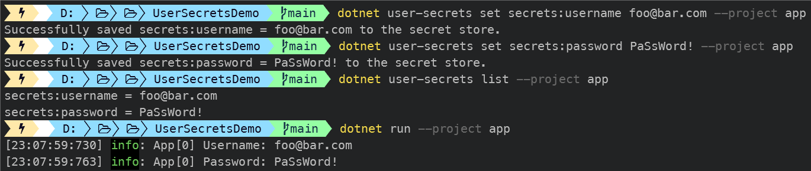

[](https://github.com/aimenux/UserSecretsDemo/actions/workflows/ci.yml)

# UserSecretsDemo
```
Using user secrets to access sensitive information
```

In this demo, i m using user secrets to access sensitive information which need to be kept out of source control :
>
> - credentials
>
> - connection strings
>
> - api keys
>
> - etc.
>

:pushpin: Enabling user secrets in .net projects can be done using :
>
> - Visual Studio (Right click on the project `App` and select Manage User Secrets)
>
> - CLI (Run Command `dotnet user-secrets init --project App` in your Terminal)

:pushpin: After enabling user secrets, an id `UserSecretsId` is added in the csproj project file.

:pushpin: User Secrets are stored **without encryption** outside of the project tree in this path :
>
> - For Windows : `%APPDATA%\Microsoft\UserSecrets\<UserSecretsId>\secrets.json`
>
> - For Linux/macOS : `~/.microsoft/usersecrets/<UserSecretsId>/secrets.json`

:pushpin: User Secrets CLI tool provide some interesting commands :
>
> - Use `dotnet user-secrets list --project App` to list user secrets
>
> - Use `dotnet user-secrets set SomeSecretKey SomeSecretValue --project App` to set user secrets
>
> - Use `dotnet user-secrets clear --project App` to clear user secrets
>

:pushpin: User Secrets should be used [only for local development and never in production](https://docs.microsoft.com/en-us/aspnet/core/security/app-secrets?view=aspnetcore-6.0&tabs=windows#secret-manager). 
>
> - For production, you can use `Azure Key Vault` or `appsettings.Production.json` file.


>

**`Tools`** : vs22, net 6.0, user-secrets
